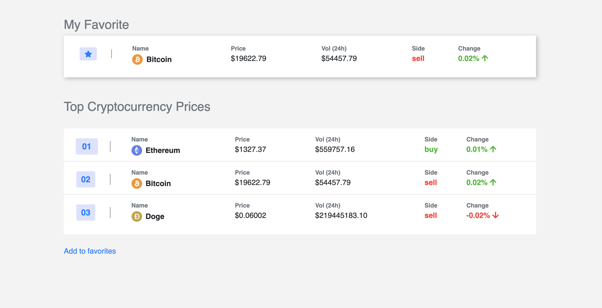

### An example of updating the cryptocurrency price in real time using Coinbase API

## Common setup

Clone the repo and install the dependencies.

```bash
git clone https://github.com/Rustam22/real-time-crypto-prices
cd real-time-crypto-prices
```

```bash
npm install
```

## Environmental variables
Open `.env` and inject your credentials if needed, so it looks like this

```
PORT=<PORT>
API_KEY=<API_KEY>
API_SECRET=<API_SECRET>
PASSPHRASE=<PASSPHRASE>
```


## Steps for read-only access

To start the express server, run the following

```bash
npm run dev
```

Open [http://localhost:8080](http://localhost:8080) and take a look around.


